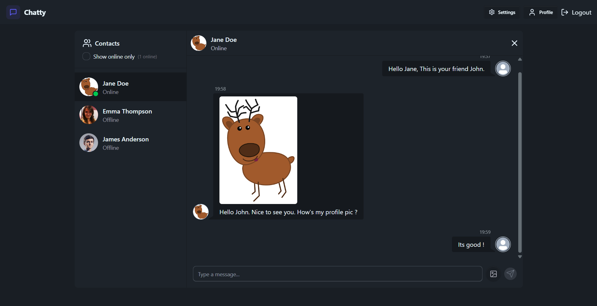

# Chatty (A minimalistic, modern and real time chat app)

### The website is hosted online. Click [here](https://chatty-0dn2.onrender.com) to visit the site.

## Screenshot of the website:

## Description

This is a very basic full stack web application with the functionality of web real time communication built using the MERN stack.  
This app was built to learn the working of web, text stacks, their use and handling the web development part.

## The technologies used are:

-   **Frontend**: React JS, Tailwind CSS, React-Toasters, Lucide-React-icons.
-   **Backend**: Node JS, Express JS, Mongoose, JWT (For Authentication), Socket.io (For real time communication).
-   **Database**: MongoDB Atlas (For web hosting of text), cloudinary (For web hosting of images).
-   **Hosting**: Render.
